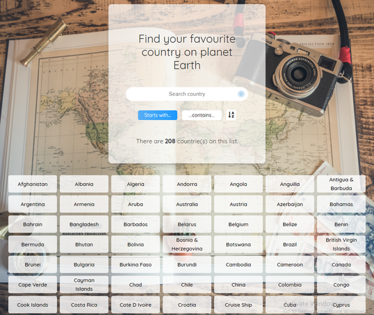

# Developing an interactive Counry finder App

This app is developed as part of my 6 months coding bootcamp at Integrify Helsinki. It is about searching any country on the list with an on the fly search results. You can either search by the starting or containing characters. I have implemented the project using javaScript and DOM manipulation techniques. All functionalities was completed with ONLY Vanilla JavaScript. Happy Coding 😀.

## Demo

You can see the live demo of the App here:

[(https://sulaymon333.github.io/Country-finder-App/)](https://sulaymon333.github.io/Country-finder-App/)

# 

## Author

Sulaymon Tajudeen. [Learn More](https://sulaymontajudeen.com/)

## Technologies

- HTML
- CSS
- javaScript (Vanilla)

## License

This project is licensed under the MIT License - see the [LICENSE.md](./LICENSE.md) file for details.
